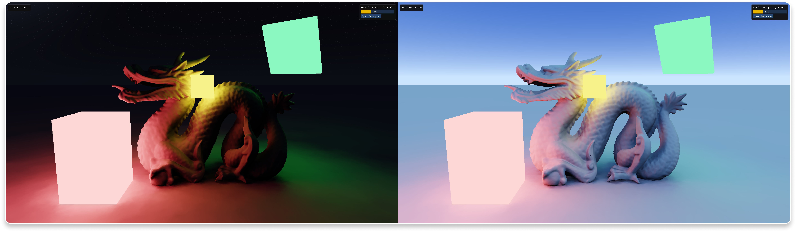
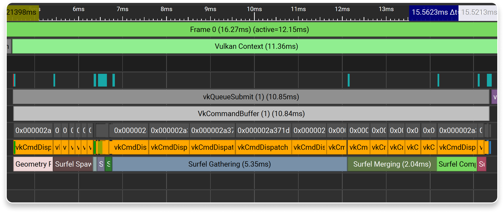

<h1 align="center">
    

      Surfel Radiance Cascades
    

</h1>

  Diffuse <b>Global Illumination</b>. 

 

    

## Brief
This repository contains an experimental implementation of diffuse global illumination.  
Making use out of [Radiance Cascades (RC)](https://github.com/Raikiri/RadianceCascadesPaper) consisting of [Surfel](https://www.ea.com/seed/news/siggraph21-global-illumination-surfels) Probes.

The entire render pipeline consists of 2 interleaved parts, Surfel maintenance & Radiance gathering.  
Surfel maintenance as the name suggests maintains the Surfels, spawning and recycling them as you move.  
For more info on Surfel maintenance, check out my [blog post](https://m4xc.dev/blog/surfel-maintenance/) :)

Radiance gathering is split into 3 parts:
1. **Gathering** Ray-tracing the probe rays through the scene to gather radiance.
2. **Merging** Merging Surfel cascades from top to bottom in typical RC fashion.
3. **Compositing** Integrating the flux passing through each on-screen pixel using Cascade 0.

 

<h2></h2>

    © 2025 Max &lt;mxcop&gt;, All rights reserved — <a href="./license.md">MIT</a>.
    

